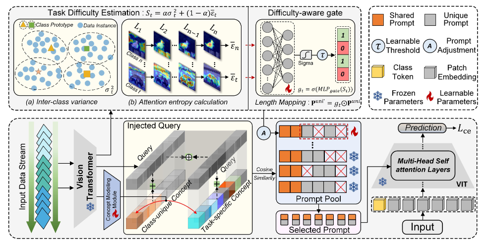

Official repo for RCG-Prompt: Fine-Grained Continual Learning via Residual Concept Guiding.

### The overall structure of our model:
<p align="center">

</p>


🗂️ Dependencies

1. [torch 2.0.1](https://github.com/pytorch/pytorch)
2. [torchvision 0.15.2](https://github.com/pytorch/vision)
3. [timm 0.6.12](https://github.com/huggingface/pytorch-image-models)
4. [tqdm](https://github.com/tqdm/tqdm)
5. [numpy](https://github.com/numpy/numpy)
6. [scipy](https://github.com/scipy/scipy)
7. [easydict](https://github.com/makinacorpus/easydict)


🔑 Run experiment

1. Edit the `coda_prompt.json` file for global settings and hyperparameters.
2. Run coda_prompt:

    ```bash
    python main.py --config=./exps/coda_prompt.json
    ```
